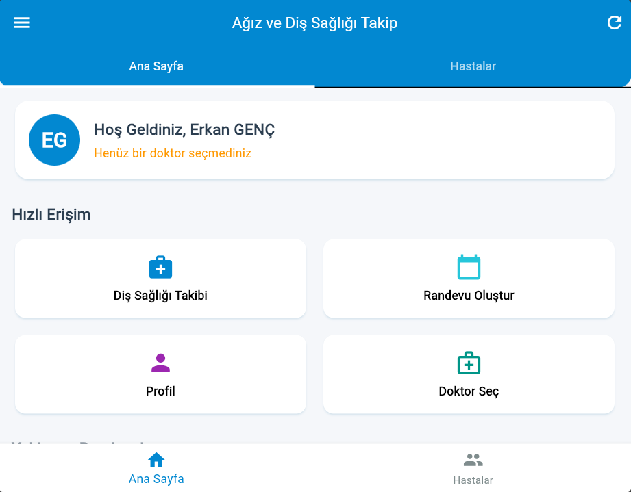
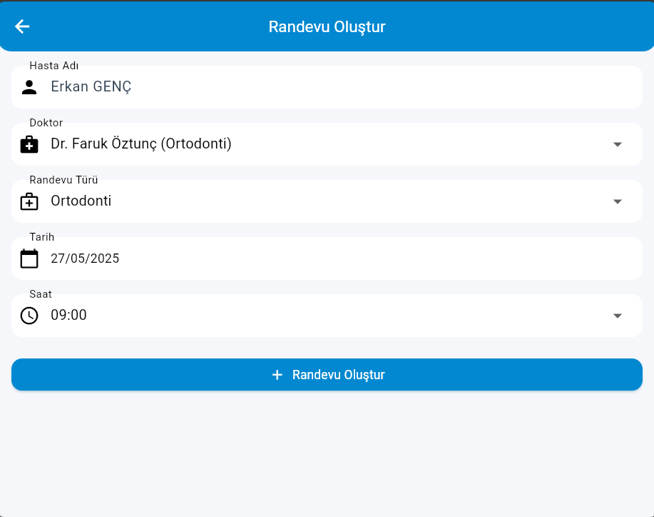
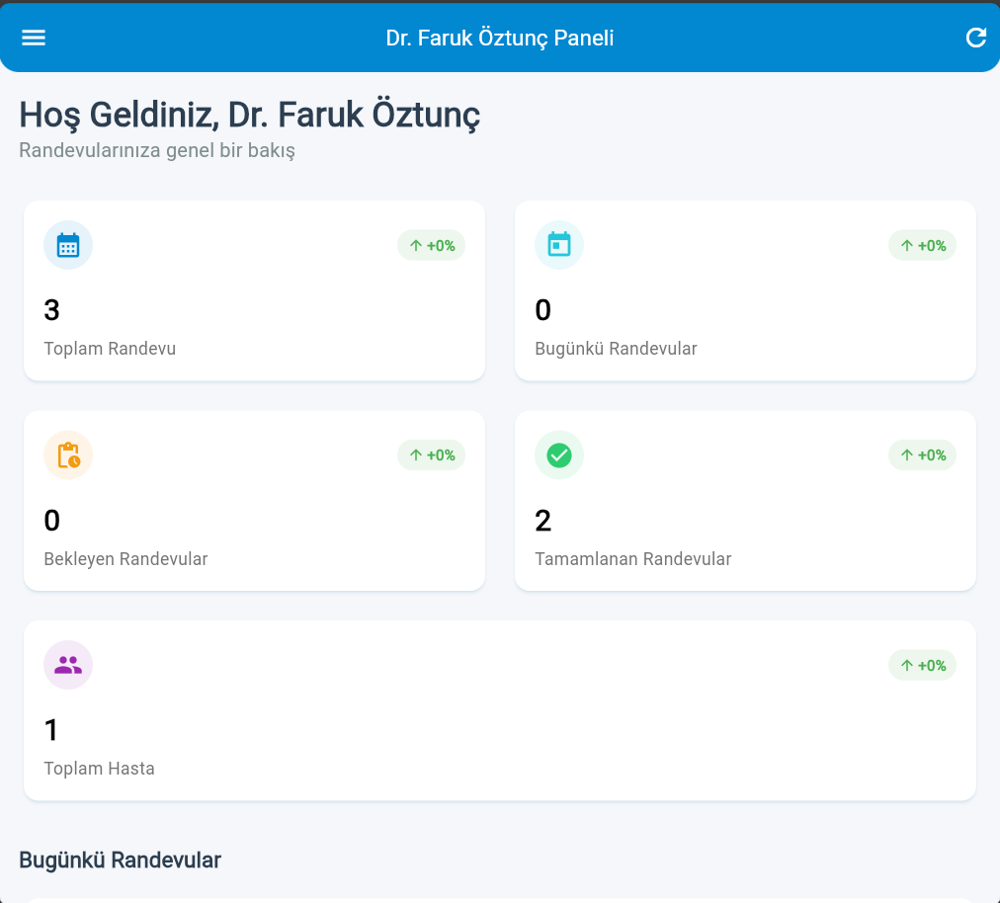
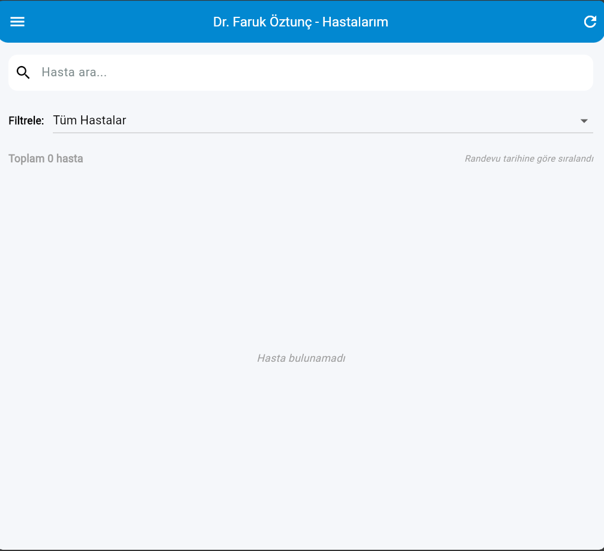
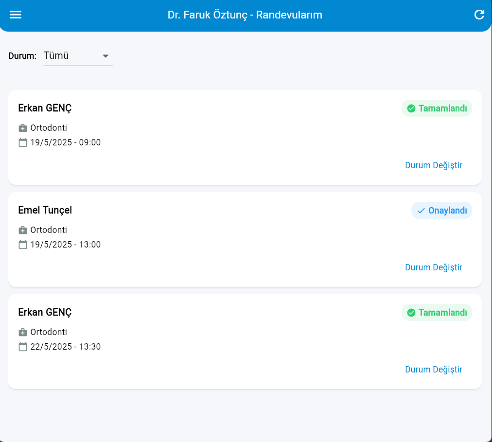
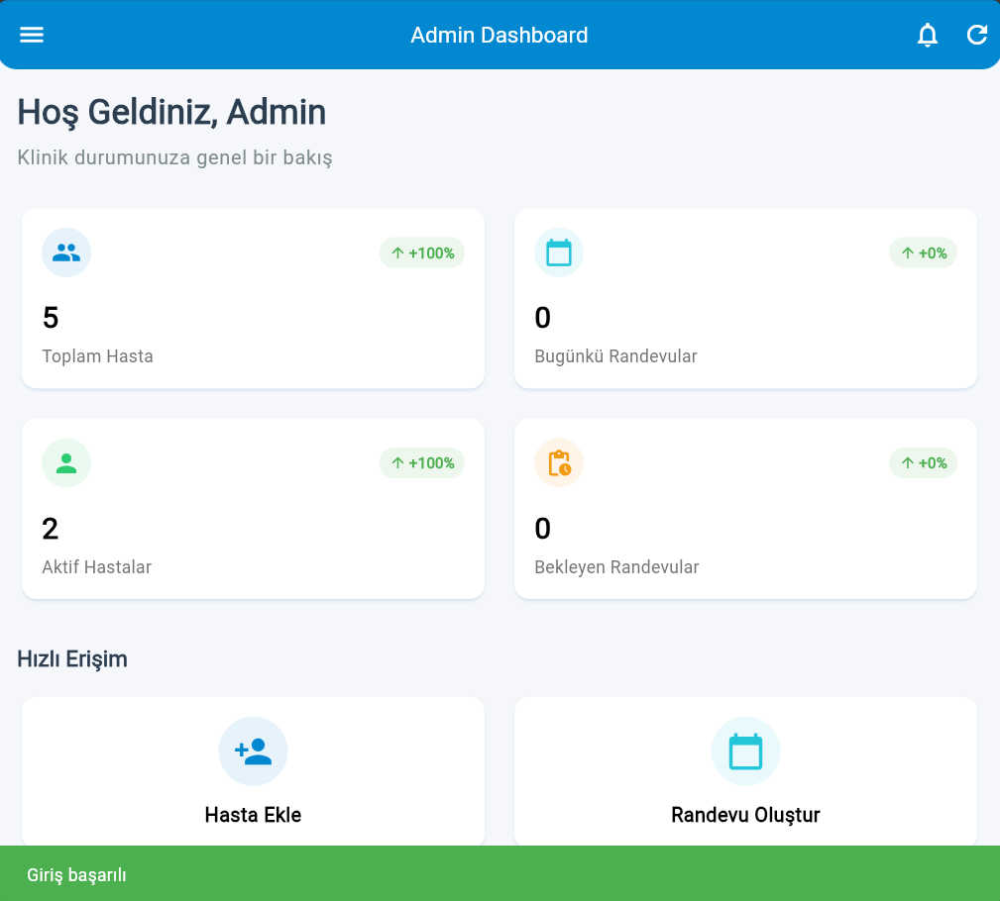
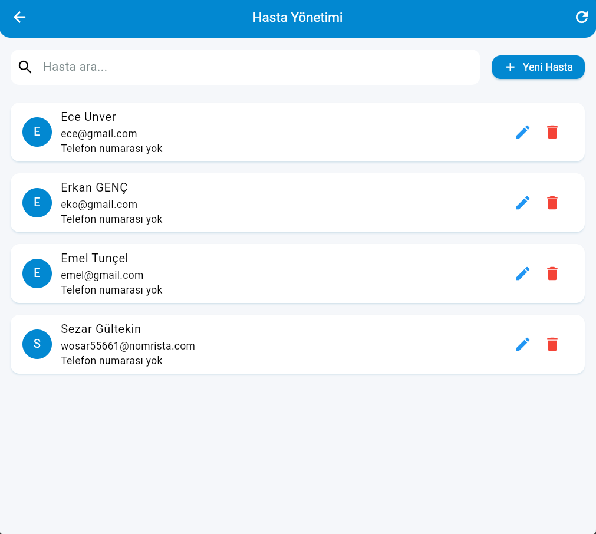

# Ağız ve Diş Sağlığı Takip Uygulaması

Bu proje, hastaların diş sağlığını takip etmelerini, randevularını yönetmelerini ve diş hekimleriyle iletişim kurmalarını sağlayan kapsamlı bir web ve mobil uygulamadır.

## 🚀 Teknolojiler

### Backend
- **.NET Core**: Web API ve servis katmanı
- **Entity Framework Core**: Veritabanı işlemleri
- **N-Tier Architecture**: Katmanlı mimari yapısı
  - Core: Temel modeller ve arayüzler
  - Infrastructure: Veritabanı ve harici servis entegrasyonları
  - Services: İş mantığı ve servis implementasyonları
  - API: Controller'lar ve endpoint'ler

### Frontend
- **Flutter**: Cross-platform mobil ve web uygulama geliştirme
- **Provider**: Durum yönetimi
- **http**: API istekleri
- **shared_preferences**: Yerel depolama
- **fl_chart**: Grafik ve istatistik gösterimleri

## 🌟 Özellikler

### Hasta Özellikleri
- 👤 Kullanıcı kaydı ve girişi
- 📅 Randevu oluşturma ve yönetimi
- 🦷 Diş sağlığı takibi
- 📊 Sağlık istatistikleri görüntüleme
- 🔔 Bildirim ayarları

### Doktor Özellikleri
- 👨‍⚕️ Hasta randevularını yönetme
- 📋 Hasta kayıtlarını görüntüleme
- 📈 İstatistikler ve raporlar
- ⚙️ Doktor profil yönetimi

### Admin Özellikleri
- 👥 Kullanıcı yönetimi
- 👨‍⚕️ Doktor yönetimi
- 📊 Sistem raporları
- ⚙️ Sistem ayarları

## 🛠️ Kurulum

### Backend Kurulumu
1. Visual Studio 2022 veya daha yeni bir sürümü yükleyin
2. .NET 8.0 SDK'yı yükleyin
3. Projeyi klonlayın
4. `FullstackWithFlutter.sln` dosyasını açın
5. Veritabanı bağlantı ayarlarını `appsettings.json` dosyasında yapılandırın
6. Package Manager Console'da migration'ları uygulayın:
   ```
   Update-Database
   ```
7. Projeyi çalıştırın

### Frontend Kurulumu
1. Flutter SDK'yı yükleyin (3.0.0 veya üzeri)
2. Projeyi klonlayın
3. Bağımlılıkları yükleyin:
   ```
   flutter pub get
   ```
4. API URL'sini yapılandırın
5. Uygulamayı çalıştırın:
   ```
   flutter run
   ```

## 🔒 Güvenlik

- JWT tabanlı kimlik doğrulama
- Rol tabanlı yetkilendirme (Admin, Doktor, Hasta)
- Güvenli parola politikaları
- HTTPS protokolü desteği

## 🤝 Katkıda Bulunma

1. Bu repository'yi fork edin
2. Yeni bir branch oluşturun (`git checkout -b feature/amazing-feature`)
3. Değişikliklerinizi commit edin (`git commit -m 'feat: Add amazing feature'`)
4. Branch'inizi push edin (`git push origin feature/amazing-feature`)
5. Bir Pull Request oluşturun

## 📝 Lisans

Bu proje MIT lisansı altında lisanslanmıştır. Daha fazla bilgi için `LICENSE` dosyasına bakın.

## 📞 İletişim

Proje Sahibi - [@ErkanGENC](https://github.com/ErkanGENC)

Proje Linki: [https://github.com/ErkanGENC/project1](https://github.com/ErkanGENC/project1)

## 📱 Ekran Görüntüleri

### Hasta Paneli





### Doktor Paneli




### Admin Paneli




## 📚 API Dokümantasyonu

### Kimlik Doğrulama Endpoint'leri

```http
POST /api/Auth/Login
POST /api/Auth/Register
POST /api/Auth/ForgotPassword
```

### Hasta Endpoint'leri

```http
GET /api/Users/GetCurrentUser
GET /api/Users/{userId}
PUT /api/Users/UpdateUser/{userId}
GET /api/DentalTracking/user/{userId}
```

### Randevu Endpoint'leri

```http
GET /api/Appointments/GetAllAppointments
POST /api/Appointments/CreateAppointment
PUT /api/Appointments/{id}
DELETE /api/Appointments/{id}
```

### Doktor Endpoint'leri

```http
GET /api/Doctors/GetAllDoctors
GET /api/Doctors/{id}
POST /api/Doctors/CreateDoctor
PUT /api/Doctors/{id}
```

### Admin Endpoint'leri

```http
GET /api/Reports/GetReportData
GET /api/Admin/dashboard
GET /api/Admin/users
GET /api/Admin/doctors
```

Her endpoint için detaylı bilgi ve örnek kullanımlar için [API.md](docs/API.md) dosyasına bakabilirsiniz.

## ❓ Sık Sorulan Sorular

### 1. Uygulama hangi platformlarda çalışır?
Flutter kullanıldığı için uygulama iOS, Android, Web ve Desktop platformlarında çalışabilir. Şu an aktif olarak Web ve Android platformları desteklenmektedir.

### 2. Offline kullanım mümkün mü?
Hayır, uygulama online çalışmak üzere tasarlanmıştır. Ancak bazı temel özellikler için offline cache mekanizması bulunmaktadır.

### 3. Hasta verilerinin güvenliği nasıl sağlanıyor?
- Tüm veriler şifrelenmiş olarak saklanır
- HTTPS protokolü kullanılır
- JWT tabanlı kimlik doğrulama sistemi mevcuttur
- Rol bazlı yetkilendirme sistemi kullanılır
- Düzenli güvenlik güncellemeleri yapılır

### 4. Randevu iptali/değişikliği nasıl yapılır?
Hastalar, randevularını randevu saatinden 24 saat öncesine kadar iptal edebilir veya değiştirebilir. Bu işlemler için:
1. Ana sayfadaki "Randevularım" bölümüne gidin
2. İlgili randevuyu seçin
3. "Düzenle" veya "İptal Et" seçeneğini kullanın

### 5. Diş hekimi değişikliği yapılabilir mi?
Evet, hastalar mevcut diş hekimlerini değiştirebilir. Bunun için:
1. Profil sayfasına gidin
2. "Diş Hekimi Değiştir" seçeneğini kullanın
3. Yeni diş hekiminizi seçin

